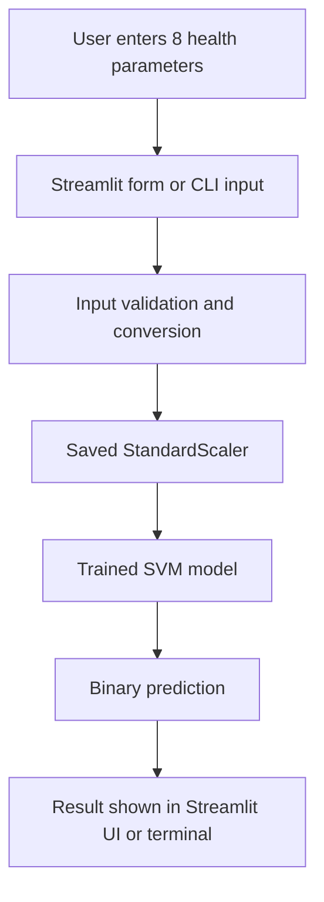

<div align="center">

# Diabetes Risk Predictor

### Machine Learning App for Early Diabetes Risk Screening

A Streamlit-based diabetes prediction project that uses a trained Support Vector Machine model and saved scaler to assess risk from 8 health parameters through a polished web interface and a simple command-line script.

[](https://diabetes-predict-web.streamlit.app)
[](https://python.org)
[](https://streamlit.io)
[](https://scikit-learn.org)

---

**Enter 8 medical measurements, get an instant diabetes risk prediction, and view guidance for the next step.**

[Live Demo](https://diabetes-predict-web.streamlit.app) · [Report Bug](https://github.com/daivagnaa/diabetes-prediction-project/issues) · [Request Feature](https://github.com/daivagnaa/diabetes-prediction-project/issues)

</div>

---

## The Problem

Early diabetes screening is often delayed because the risk factors are spread across several measurements. Manual interpretation can be slow, inconsistent, and hard to standardize for quick self-checks.

## The Solution

This project combines the Pima Indians Diabetes dataset with a trained Support Vector Machine classifier and a saved StandardScaler. The result is a small, easy-to-run application that predicts whether a person is likely diabetic based on 8 health inputs.

---

## Features

| Feature | Description |
|---------|-------------|
| Binary Risk Prediction | Predicts whether a person is likely diabetic or not diabetic |
| Standardized Inputs | Applies the saved scaler before inference for consistent predictions |
| Streamlit Web App | Provides a clean, interactive browser-based interface |
| Command-Line Prediction | Supports direct Python execution from the terminal |
| Guided Input Fields | Uses validated numeric inputs with helpful ranges and tips |
| Health Recommendations | Shows different guidance for low-risk and high-risk outcomes |
| Medical Disclaimer | Clearly states the app is for screening and educational use only |
| Saved Artifacts | Uses `trained_model.sav` and `scaler.sav` for inference |

---

## Architecture



---

## Tech Stack

<table>
  <tr>
    <td align="center"><b>Category</b></td>
    <td align="center"><b>Technology</b></td>
  </tr>
  <tr>
    <td>Language</td>
    <td>Python</td>
  </tr>
  <tr>
    <td>Machine Learning</td>
    <td>Scikit-learn, Support Vector Machine</td>
  </tr>
  <tr>
    <td>Web Framework</td>
    <td>Streamlit</td>
  </tr>
  <tr>
    <td>Data Handling</td>
    <td>NumPy, Pandas</td>
  </tr>
  <tr>
    <td>Serialization</td>
    <td>Pickle</td>
  </tr>
  <tr>
    <td>Notebook</td>
    <td>Jupyter Notebook</td>
  </tr>
</table>

---

## Project Structure

```
02. Diabites Prediction/
│
├── README.md               # Project documentation
├── DiabetesPred.ipynb      # Notebook with dataset exploration and model building
├── diabetes.csv            # Pima Indians Diabetes dataset
├── predictive_system.py    # CLI prediction script
├── Web_App.py              # Streamlit web application
├── WorkFlow.txt            # Simple workflow outline
├── trained_model.sav       # Saved SVM model
└── scaler.sav              # Saved StandardScaler
```

---

## Dataset

The project uses the **Pima Indians Diabetes Database**, a classic binary classification dataset with 8 input features:

| Feature | Description |
|---------|-------------|
| Pregnancies | Number of times pregnant |
| Glucose | Plasma glucose concentration |
| BloodPressure | Diastolic blood pressure |
| SkinThickness | Triceps skin fold thickness |
| Insulin | 2-hour serum insulin |
| BMI | Body mass index |
| DiabetesPedigreeFunction | Family history / pedigree score |
| Age | Age in years |

The target label is `Outcome`, where `0` means not diabetic and `1` means diabetic.

---

## How It Works

### 1. Data Preparation
- The notebook loads the CSV dataset and explores the feature distribution.
- Features are separated from the target label.
- A StandardScaler is fitted during training and saved for inference.

### 2. Model Training
- A Support Vector Machine classifier is trained on the standardized features.
- The trained model is saved as `trained_model.sav`.
- The scaler is saved separately as `scaler.sav`.

### 3. Inference
- User inputs are converted to numeric values.
- Inputs are reshaped into a single-row NumPy array.
- The saved scaler transforms the data before prediction.
- The model returns a binary risk label.

### 4. Result Display
- The Streamlit app shows the risk result with color-coded messaging.
- If the result indicates higher risk, the app displays medical follow-up guidance.
- The CLI script prints the prediction directly in the terminal.

---

## Input Format

Enter the values in this exact order:

| Parameter | Example Type | Notes |
|-----------|--------------|-------|
| Pregnancies | Integer | Number of pregnancies |
| Glucose | Integer | Glucose level in mg/dL |
| BloodPressure | Integer | Diastolic blood pressure in mmHg |
| SkinThickness | Integer | Skin fold thickness in mm |
| Insulin | Integer | Serum insulin in μU/mL |
| BMI | Float | Body mass index |
| DiabetesPedigreeFunction | Float | Genetic likelihood score |
| Age | Integer | Age in years |

Example input used in the CLI script:

```python
(5, 166, 72, 19, 175, 25.8, 0.587, 51)
```

---

## Getting Started

### Prerequisites

<<<<<<< HEAD
- Python 3.x
- A virtual environment is recommended
- Dependencies listed in `requirements.txt`
=======
### 🌐 Access Web Application
Visit the live demo: **[Diabetes Risk Predictor](https://diabetes-predict-web.streamlit.app)**
>>>>>>> af5ad9d3b1e57d0240381dec343be54c8d745957

### Installation

1. Clone or open the project folder.

   ```bash
   cd "02. Diabites Prediction"
   ```

2. Create and activate a virtual environment.

   ```bash
   python -m venv .venv
   .\.venv\Scripts\activate
   ```

3. Install the required packages.

   ```bash
   pip install -r requirements.txt
   ```

### Run the Project

Launch the web application:

```bash
streamlit run Web_App.py
```

Run the command-line predictor:

```bash
python predictive_system.py
```

Open the notebook for the training workflow:

<<<<<<< HEAD
```bash
jupyter notebook DiabetesPred.ipynb
```
=======
For making predictions, provide the following 8 features in order:

| Parameter | Range | Unit | Description |
|-----------|-------|------|-------------|
| Pregnancies | 0-20 | count | Number of pregnancies |
| Glucose | 0-300 | mg/dL | Plasma glucose concentration |
| Blood Pressure | 0-200 | mmHg | Diastolic blood pressure |
| Skin Thickness | 0-100 | mm | Triceps skin fold thickness |
| Insulin | 0-900 | μU/mL | 2-Hour serum insulin |
| BMI | 10.0-70.0 | kg/m² | Body Mass Index |
| Diabetes Pedigree | 0.0-3.0 | score | Genetic diabetes likelihood |
| Age | 1-120 | years | Age in years |

**Example Non-Diabetic Input**: `(1, 85, 66, 29, 0, 26.6, 0.351, 31)`
**Example Diabetic Input**: `(8, 183, 64, 0, 0, 23.3, 0.672, 32)`

## ✨ Web Application Features

### 🎨 User Experience
- **Modern Design**: Beautiful gradient backgrounds and animations
- **Interactive Elements**: Hover effects and smooth transitions
- **Loading Animations**: Spinner during prediction analysis
- **Success Celebrations**: Balloons for negative diabetes predictions
- **Color-coded Results**: Green for safe, red for high-risk predictions

### 🏥 Health Features
- **Comprehensive Health Tips**: Tailored recommendations based on results
- **Emergency Guidelines**: Important steps for high-risk cases
- **Medical Disclaimers**: Clear ethical use guidelines
- **Parameter Guidelines**: Helpful ranges and normal values

### 👨‍💻 Developer Features
- **Professional Branding**: Prominent developer information
- **Contact Integration**: Direct GitHub and email links
- **Dark Theme Support**: Automatic adaptation to user preferences
- **Responsive Design**: Works on desktop and mobile devices

## 🛠 Technologies Used

- **Python 3.x**: Core programming language
- **Pandas**: Data manipulation and analysis
- **NumPy**: Numerical computing
- **Scikit-learn**: Machine learning algorithms and preprocessing
- **Streamlit**: Web application framework and cloud deployment
- **Pickle**: Model and scaler serialization
- **Jupyter Notebook**: Interactive development environment
- **CSS**: Custom styling for enhanced UI

## 🌐 Deployment

The application is deployed on **Streamlit Community Cloud** for free public access:
- **Platform**: Streamlit Cloud
- **URL**: [diabetes-prediction-web-app.streamlit.app](https://diabetes-predict-web.streamlit.app)
- **Auto-deployment**: Linked to GitHub repository for continuous deployment
- **Uptime**: 99.9% availability with global CDN

## 🔮 Future Enhancements

- [ ] 📊 Add interactive data visualization and EDA charts
- [ ] 🤖 Implement ensemble methods (Random Forest, Gradient Boosting)
- [ ] 🔍 Include cross-validation and hyperparameter tuning
- [ ] 📈 Add model interpretability features (SHAP, LIME)
- [ ] ☁️ Deploy to additional cloud platforms (Heroku, AWS, Azure)
- [ ] 📱 Create mobile application version
- [ ] 🎯 Add confidence scores and probability distributions
- [ ] 📊 Include batch prediction capabilities
- [ ] 🔐 Add user authentication and prediction history
- [ ] 🌍 Multi-language support

## 👨‍💻 Developer

**Daivagna Parmar**
- 📧 **Email**: [devparmar1895@gmail.com](mailto:devparmar1895@gmail.com)
- 🔗 **GitHub**: [@daivagnaa](https://github.com/daivagnaa)
- 💼 **LinkedIn**: [Daivagna Parmar](https://in.linkedin.com/in/daivagna-parmar-949315316)

## 📜 License & Disclaimer

⚠️ **Medical Disclaimer**: This application is for educational and screening purposes only. Always consult qualified healthcare professionals for medical diagnosis and treatment.

## 🤝 Contributing

Contributions are welcome! Please feel free to submit a Pull Request or open an Issue for suggestions and improvements.
>>>>>>> af5ad9d3b1e57d0240381dec343be54c8d745957

---

## Example Usage

<<<<<<< HEAD
### Web App
Open the Streamlit app, enter the 8 health parameters, and click the analyze button to get a risk prediction.

### CLI Prediction

```bash
python predictive_system.py
```

The script uses a sample input and prints the predicted result in the terminal.

---

## Workflow

According to `WorkFlow.txt`, the project follows this flow:

1. Diabetes data collection
2. Data preprocessing
3. Train-test split
4. Support Vector Machine classifier

---

## Model Notes

- The model is trained for binary classification.
- Input scaling is required for reliable predictions.
- The project uses saved artifacts for fast loading and reuse.
- The Streamlit app adds validation, UI polish, and screening guidance.

---

## Health Disclaimer

This project is intended for educational and screening purposes only. It is not a medical diagnosis tool. Always consult a qualified healthcare professional for medical advice, diagnosis, or treatment.

---

## Developer

**Daivagna Parmar**

- Email: devparmar1895@gmail.com
- GitHub: https://github.com/daivagnaa

---

## License

No explicit license file is present in the repository. If you plan to publish or reuse this project, add a license that matches your intended usage.
=======
**⭐ Star this repository if you found it helpful!**
>>>>>>> af5ad9d3b1e57d0240381dec343be54c8d745957
